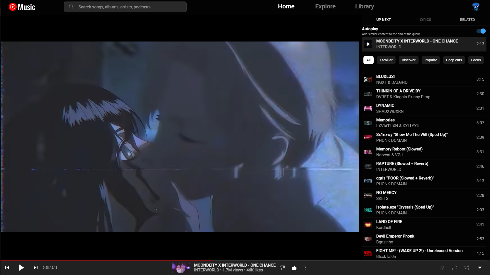
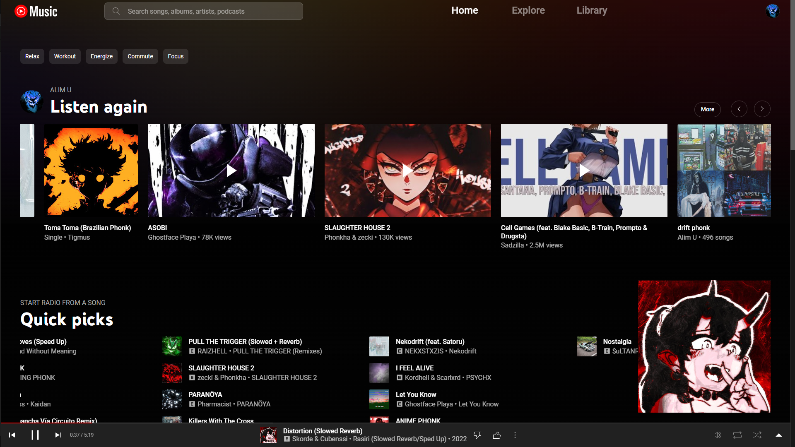

YouTube Music style. Configured for full hd fullscreen

Features:
- wider home layout
- bigger mini-player
- bigger image/video with fullscreen player
- narrower navbar and player bar
- removed sidebar
- sidebar links moved to navigation
- "upgrade" link, "cast to device" button are hidden

 

    <i>player page</i>

 

    <i>home page</i>

Available on [userstyles.org](https://userstyles.org/styles/265797/youtube-music-wide-layout-big-player)
